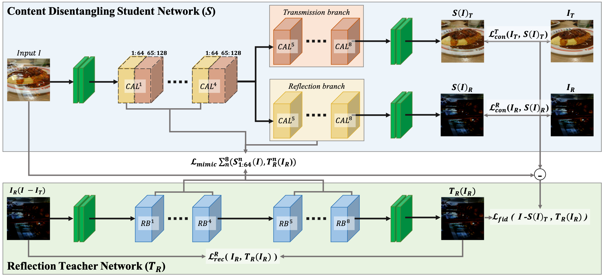

# I-Sheng Fang / Ethan Fang / 方 宜晟 / Gî-Tshiânn Png
("I-Sheng" pronounce like "Ethan")

[[github]](https://github.com/IShengFang) [[facebook]](https://www.facebook.com/I.Sheng.Fang) [[instagram]](https://www.instagram.com/ishengfang/) [[linkedin]](https://www.linkedin.com/in/i-sheng-fang-83293598/) [[curriculum vitae]](./ishengfang_cv.pdf) [[google scholar]](https://scholar.google.com/citations?user=zLeqqSwAAAAJ)

I am a Research Assistant in CITI at Academia Sinica, working with [Dr. Jun-Cheng Chen](https://www.citi.sinica.edu.tw/pages/pullpull/index_en.html). Before that, I received my Master degree in Robotics at National Yang Ming Chiao Tung University (the merger of National Chiao Tung University and National Yang Ming University) in January, 2023. My advisors are  [Prof. Yong-Sheng Chen](https://www.cs.nctu.edu.tw/members/detail/yschen) and  [Prof. Wei-Chen (Walon) Chiu](https://walonchiu.github.io/). I was a graduate student of Department of Computer Science in National Cheng Chi University, Taiwan, working with [Prof. Yan-Tsung Peng ](http://www.cs.nccu.edu.tw/~ytpeng/). I was a research assistants of Enriched Vision Applications Lab, National Chiao Tung University from September 2018 to September 2019, working with [Prof. Wei-Chen (Walon) Chiu](https://walonchiu.github.io/). I received my Bachelor degree in Mathematical Science at National Chengchi University in January, 2018.

My research interests are in the area of generative model, self/wakly-supervised learning, depth estimation, style transfer, computer vision, and deep learning. I am also interested in their creative application, such as East Asian Ideograph font design, deepfake for education. I believe AI is a leverage, augmenting human ability not only in monotonous tasks but also in content creation. 

My personal interests are Typography, Film Photography (check out my instagram [@ishengfang](https://www.instagram.com/ishengfang/)), Baseball, Strength and Conditioning Training.

## Publications

### Best of Both Sides: Integration of Absolute and Relative Depth Sensing Modalities Based on iToF and RGB Cameras

- **I-Sheng Fang**, Wei-Chen Chiu, Yong-Sheng Chen
- International Conference on Pattern Recognition (ICPR), 2024.
- [[github(comming soon)]]

### ES³Net: Accurate and Efficient Edge-Based Self-Supervised Stereo Matching Network

- **I-Sheng Fang**, Hsiao-Chieh Wen, Chia-Lun Hsu, Po-Chung Jen, Ping-Yang Chen, Yong-Sheng Chen
- IEEE/CVF Conference on Computer Vision and Pattern Recognition Workshops (CVPRW), 2023.
  - [The 19th Embedded Vision Workshop](https://embeddedvisionworkshop.wordpress.com/2024/01/03/2023/)
    - **Best Paper Award**
- [[github]](https://github.com/IShengFang/ES3Net)[[CVPRW2023]](https://openaccess.thecvf.com/content/CVPR2023W/EVW/html/Fang_ES3Net_Accurate_and_Efficient_Edge-Based_Self-Supervised_Stereo_Matching_Network_CVPRW_2023_paper.html)

### Single Image Reflection Removal based on Knowledge-distilling Content Disentanglement

- Yan-Tsung Peng, Kai-Han Cheng, **I-Sheng Fang**, Wen-Yi Peng, Jr-Shian Wu
- IEEE Signal Processing Letters(SPL) Feb. 2022 
- [[IEEE Xplore]](https://ieeexplore.ieee.org/document/9705543)[[github]](https://github.com/ytpeng-aimlab/Image-Reflection-Removal-based-on-Knowledge-distilling-Content-Disentanglement)

### Self-Contained Stylization via Steganography for Reverse and Serial Style Transfer

- Hung-Yu Chen†, **I-Sheng Fang†**, Chia-Ming Cheng, Wei-Chen Chiu († indicates equal contribution.) 
- IEEE Winter Conference on Applications of Computer Vision (WACV), 2020.
- [[arxiv]](https://arxiv.org/pdf/1812.03910.pdf)[[github]](https://github.com/IShengFang/Self-Contained_Stylization)[[project page]](https://ishengfang.github.io/Self-Contained_Stylization/)[[WACV2020]](https://openaccess.thecvf.com/content_WACV_2020/html/Chen_Self-Contained_Stylization_via_Steganography_for_Reverse_and_Serial_Style_Transfer_WACV_2020_paper.html)[[poster]](https://raw.githubusercontent.com/IShengFang/Self-Contained_Stylization/master/poster.pdf)

## Projects
### A Century of Heartfelt Sentiment: 100th Anniversary Special Exhibition of the Taiwan Cultural Association

- 2021/05/08 - 2022/05/08
- Exhibition Room D, National Museum of Taiwan Literature, Tainan, Taiwan
- Synthesizing DeepFake video for historical figures of Taiwan Cultural Association.
- [[exhibition page(English)]](https://www.nmtl.gov.tw/en/News_Content_Due.aspx?n=3915&s=139324)[[exhibition page(Mandarin)]](https://event.culture.tw/NMTL/portal/Registration/C0103MAction?useLanguage=tw&actId=10591&request_locale=tw)[[exhibition page(Japanese)]](https://www.nmtl.gov.tw/jp/exhibition_85_246.html)[[press release (English)]](https://www.moc.gov.tw/en/information_197_127326.html)[[press release (Mandarin)]](https://www.moc.gov.tw/information_250_127289.html)[[fanpage post]](https://www.facebook.com/tw.bankofculture/posts/4759014084138383)

<iframe src="https://www.facebook.com/plugins/video.php?height=476&href=https%3A%2F%2Fwww.facebook.com%2Ftw.bankofculture%2Fvideos%2F972692466643347%2F&show_text=false&width=267&t=0" width="267" height="476" style="border:none;overflow:hidden" scrolling="no" frameborder="0" allowfullscreen="true" allow="autoplay; clipboard-write; encrypted-media; picture-in-picture; web-share" allowFullScreen="true"></iframe>

## Education

- Master of Science
  - The Master's Degree Program in Robotics, National Yang Ming Chiao Tung University, Taiwan.
    - Merged by National Chiao Tung University and National Yang Ming University on 1, February, 2021.
  - September, 2020 - February, 2023

- Graduate Student
  - Computer Sciences, National Chengchi University.
  - January, 2020 - June, 2020
  
- Bachelor of Science
  - Mathematical Sciences, National Cheng Chi University, Taiwan.
  - September, 2013 - January, 2018

## Experience

- Research Assistant
  - Research Center for Information Technology Innovation(CITI), Academia Sinica, Taiwan.
  - March, 2024 - 
  - Working on generative model with [Dr. Jun-Cheng Chen](https://www.citi.sinica.edu.tw/pages/pullpull/index_en.html).
- Software Engineer Intern
  - Microsoft AI R&D Center, Taiwan
  - March, 2022 - November, 2022
  - Working on vision transformer(ViT), percpetual loss, and generative model with SunDa Yang, [Chien-Yi Wang](https://chienyiwang.github.io/), [Prof. Shang-Hong Lai](https://www.cs.nthu.edu.tw/~lai/), and [Dr. Trista Chen](https://www.linkedin.com/in/tristachen), and the face science team. 
- Research Assistant
  - Enriched Vision Applications Lab, National Chiao Tung University, Taiwan.
  - September, 2018 - September, 2019
  - Working on style transfer and generative model with [Prof.Wei-Chen (Walon) Chiu](https://walonchiu.github.io/)
- Teaching Assistant
  - The First Step of AI and Deep Learning with Python, the MOOCs of National Chengchi University.
  - July, 2018 - September, 2018
  - Teacher is Prof. Yen-lung Tsai.
- Fire Fighting Substitute Military Services
  - YungPing Branch, Yonghe Squadron, Seventh Crops, Fire Department, New Taipei City Government
  - March, 2018 - June, 2018
- Deep Learning Scientist
  - InQtech Co.,Ltd
  - September, 2017 - June, 201
- Teaching Assistant
  - The First Step of Data Analysis with Python, the MOOCs of National Chengchi University.
  - September, 2017 - January, 2018
  - Teacher is Prof. Yen-lung Tsai.
- Intern
  - Leopard Mobile
  - July, 2017 - September, 2017
- GAN Discussion Host
  - NCCU Deep Learning & TWSIAM Student Group
  - Winning  *first* place of study group final presentation in NCCU. 

## Open Source Projects

- [Relativistic average GAN with Keras](https://github.com/IShengFang/Relativistic-average-GAN-Keras), 2018
- [Spectral Normalization for Keras](https://github.com/IShengFang/SpectralNormalizationKeras), 2018
- [ResNet-DenseNet-Notebook](https://github.com/IShengFang/ResNet-DenseNet-Notebook), 2018

## Reseach Collections
- [Typography Research Collection](https://github.com/IShengFang/TypographyResearchCollection)
  - Typography is the cross between technology and liberal arts. This page is a research collection that includes computer graphics, computer vision, machine learning that related to typography.
  - If anyone found new research, please email it to me :)

## Other Research Projects
- Font Design with Progressive invariant GANs
  - *Honorable Mention* of MOST Workshop on Generative Adversarial Networks and GAN Project Competition, 2017.
  - Introduced GLCM, a invariant, in progressive growing VAE-GAN to embed font in latent space. Generated new font or glyph by modtified the latent space Improved training speed, convergence speed and higher resolution.
- Hanzi Typeface Research with Conditional Generative Adversarial Network
  - Poster of Taiwan Society for Industrial and Applied Mathematics Annual Meeting, 2017
  - Using autoencoder and conditional GAN to embed font in latent space.
  - Advisor: Prof. Yen-Lung Tsai.
  
## Github Stats

## Service
Reviewer: NeurIPS 2024

## Contact

email(personal): [nf0126@gmail.com](mailto:nf0126@gmail.com), [ishengfang@icloud.com](mailto:ishengfang@icloud.com)

email(NCTU): [isfang.gdr09g@nctu.edu.tw](mailto:isfang.gdr09g@nctu.edu.tw)

email(NYCU): [isfang.en09@nycu.edu.tw](mailto:isfang.en09@nycu.edu.tw)

email(Academia Sinica): [ishengfang@citi.sinica.edu.tw](mailto:ishengfang@citi.sinica.edu.tw)
